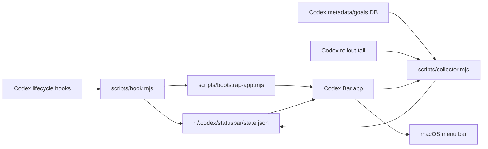

# Codex Bar

Native macOS menu bar dashboard for Codex.

Codex Bar shows useful at-a-glance state while Codex is working: live sessions, task progress, goal state, approval attention, current tool activity, and one-click links back into Codex threads.


It is intentionally boring in the places that matter:

- No Codex.app patching.
- No raw transcript mirroring.
- No raw prompt, model response, command output, or tool result storage.
- No busy polling loop in hook scripts.
- One small JSON state file under `~/.codex/statusbar/state.json`.
- A native AppKit menu bar process with a lightweight local collector and one-second UI refresh.

## Status

MacOS-first MVP under active development. The native app, local collector, hook reducer, packaging, and tests are implemented.

## Install From Codex

Add the marketplace source:

```bash
codex plugin marketplace add Cjbuilds/Codex-bar
```

Then restart Codex, open `/plugins`, choose the new marketplace, install **Codex Bar**, and review/trust its hooks when Codex asks.

The plugin starts the menu bar app on the first Codex hook event. If you paste this repository into Codex and ask it to set up the project, the intended agent command is:

```bash
npm run setup:codex
```

That validates the plugin metadata and hooks, builds and launches the native app, waits for the collector, renders the actual live state through the native formatter, samples live CPU/RSS usage, exercises approval/progress/completed state, renders those states through the native formatter, writes permission-free AppKit menu snapshots plus a cycling HTML proof, and audits the live state file for privacy leaks.

The root `AGENTS.md` repeats this setup contract for future Codex agents and records the safety rules: no Codex.app patching, no raw transcript/output persistence, Codex-generated-title-only labels, and no CI gate that depends on Screen Recording permission.

You can also build and launch only the app manually:

```bash
npm run install:local
```

`npm run install:local` builds the native app, launches it, waits for the collector, and runs the live doctor. It is the quickest local check after installing from Codex or cloning the repo.

Verify only the local app bundle and bundled collector:

```bash
npm run doctor
```

After launching the app, verify that the menu bar process, collector, and local state file are alive:

```bash
npm run doctor -- --live
```

Run a no-side-effect state smoke test for approval, progress, and completion:

```bash
npm run smoke:state
```

Render those same states through the native Swift formatter used by the menu app:

```bash
npm run smoke:render
```

Render approval and progress states produced through the public Codex hook command path:

```bash
npm run smoke:hook-render
```

Render the actual installed live state through the native formatter:

```bash
npm run smoke:live-render
```

This audits `~/.codex/statusbar/state.json`, renders it through the same Swift formatter used by the menu bar app, and verifies live rows include the Codex number, folder, session title, work state, and `codex://threads/...` deep links.

Run a short live CPU/RSS smoke after launch:

```bash
npm run smoke:perf
```

This samples the installed app and collector for 8 seconds and fails if average CPU or RSS exceeds the default thresholds.

Generate permission-free AppKit PNG snapshots from those rendered menu states:

```bash
npm run smoke:snapshot
```

The snapshots are written to `dist/snapshots/` and checked for dimensions, nonblank pixels, session row context, progress text, approval attention, and Codex deep links. This is not a substitute for a real clicked menu screenshot, but it gives CI a visual artifact without requiring Screen Recording permissions.

Generate the same native snapshots and a permission-free cycling visual proof:

```bash
npm run smoke:visual-proof
```

The HTML proof is written to `dist/visual-proof/codex-bar-native-proof.html` and cycles the approval, progress, and completed AppKit snapshots. It is deterministic and CI-safe; it still does not claim to be a real clicked menu capture.

Capture a real clicked menu screenshot on a local Mac:

```bash
npm run capture:menu
```

This first checks whether macOS allows the terminal app to capture the screen. If Screen Recording is allowed, it starts the reversible live demo, waits for the approval phase, then runs the macOS screenshot countdown. During the countdown, click the Codex Bar menu item and leave the dropdown open. The PNG is written to `dist/visual-proof/codex-bar-menu-proof.png`. macOS must grant Screen Recording permission to the terminal app running the command.

Audit the live state file for raw payload/transcript/output-shaped data:

```bash
npm run audit:privacy
```

Audit release readiness for the open-source repo, install path, CI/release workflows, docs, privacy posture, and known external proof gaps:

```bash
npm run audit:readiness
```

To also verify the current published GitHub Release zip/checksum:

```bash
npm run audit:readiness -- --published
```

Verify that Git-visible files are enough from a temporary clean checkout:

```bash
npm run smoke:clean-checkout
```

This copies the repo's Git-visible files to a temp directory without `.git`, `dist`, or `node_modules`, then runs asset freshness, plugin validation, release-readiness audit, Node tests, and release packaging there.

Temporarily demo the live menu bar attention states without touching real Codex data:

```bash
npm run demo:live
```

The demo stops the normal Codex Bar process, launches the actual native app against a temporary state file with the collector disabled, cycles through approval, progress, and completed states, then restores the normal app if it was running.

Sample live CPU and memory usage:

```bash
npm run perf:sample -- --duration-ms 30000 --interval-ms 2000
```

## Local Development

```bash
npm run generate:assets
npm run validate:plugin
npm run test
npm run test:swift
npm run setup:codex
npm run install:local
npm run smoke:state
npm run smoke:render
npm run smoke:hook-render
npm run smoke:live-render
npm run smoke:clean-checkout
npm run smoke:perf
npm run smoke:snapshot
npm run smoke:visual-proof
npm run capture:menu
npm run audit:privacy
npm run audit:readiness
npm run demo:live
npm run perf:sample -- --duration-ms 30000 --interval-ms 2000
```

Full local verification:

```bash
npm run verify
```

`npm run verify` is the same gate used by GitHub Actions on `main` and pull requests: generated asset freshness, plugin metadata validation, release-readiness audit, Node tests, clean-checkout smoke, hook state smoke, native menu render smoke, native AppKit snapshot and visual-proof smoke, Swift tests, the signed macOS app build, the install doctor, and the release artifact packager.

`npm run setup:codex` runs a smaller agent-facing path for first install. It still includes live launch verification, live-state rendering, live CPU/RSS sampling, hook rendering, native formatter checks, AppKit menu snapshots, visual proof generation, and the privacy audit. For quick repeat checks, use flags such as `--skip-install`, `--skip-live-render-smoke`, `--skip-perf-smoke`, `--skip-render-smoke`, `--skip-snapshot-smoke`, or `--skip-privacy-audit`.

Create a release zip without touching your live installed app:

```bash
npm run package:release
```

That writes `dist/codex-bar-v<version>-macos-<arch>.zip` plus a matching `.sha256` checksum. CI runs the same packager and uploads those files as a workflow artifact.

By default, local and CI release artifacts are ad-hoc signed. To create a Developer ID signed artifact from a machine that already has the certificate in its keychain:

```bash
CODEX_STATUS_BAR_SIGN_IDENTITY="Developer ID Application: Your Name (TEAMID)" npm run package:release
```

To notarize and staple the app before the final zip is written, also set `CODEX_STATUS_BAR_NOTARIZE=1` and one notarization credential set:

```bash
CODEX_STATUS_BAR_SIGN_IDENTITY="Developer ID Application: Your Name (TEAMID)" \
CODEX_STATUS_BAR_NOTARIZE=1 \
CODEX_STATUS_BAR_NOTARY_PROFILE=codex-bar \
npm run package:release
```

`CODEX_STATUS_BAR_NOTARY_PROFILE` uses a profile saved with `xcrun notarytool store-credentials`. The packager also supports App Store Connect API key variables (`CODEX_STATUS_BAR_NOTARY_KEY`, `CODEX_STATUS_BAR_NOTARY_KEY_ID`, `CODEX_STATUS_BAR_NOTARY_ISSUER`) or Apple ID app-password variables (`CODEX_STATUS_BAR_NOTARY_APPLE_ID`, `CODEX_STATUS_BAR_NOTARY_PASSWORD`, `CODEX_STATUS_BAR_NOTARY_TEAM_ID`).

Publish a GitHub Release by pushing a tag that exactly matches `package.json`:

```bash
VERSION="$(node -p "require('./package.json').version")"
git tag "v$VERSION"
git push origin "v$VERSION"
```

The release workflow runs the full verification gate, checks the tag against the package version, then attaches the release zip and checksum to the GitHub Release.

If no signing secrets are configured, the GitHub Release artifact is ad-hoc signed and verified by CI. For Developer ID signing on the hosted macOS release runner, add these repository secrets:

- `CODEX_STATUS_BAR_CERTIFICATE_P12_BASE64`: base64-encoded Developer ID Application `.p12`.
- `CODEX_STATUS_BAR_CERTIFICATE_PASSWORD`: password for that `.p12`.
- `CODEX_STATUS_BAR_SIGN_IDENTITY`: exact codesign identity, for example `Developer ID Application: Your Name (TEAMID)`.

To notarize in the same release workflow, also set `CODEX_STATUS_BAR_NOTARIZE=1` and one notarization credential set. For GitHub-hosted runners, the App Store Connect API key path is the most portable:

- `CODEX_STATUS_BAR_NOTARY_KEY_BASE64`: base64-encoded `.p8` API key.
- `CODEX_STATUS_BAR_NOTARY_KEY_ID`: App Store Connect API key ID.
- `CODEX_STATUS_BAR_NOTARY_ISSUER`: App Store Connect issuer ID.

The workflow writes the `.p8` to a temporary runner file and passes that file path to the packager as `CODEX_STATUS_BAR_NOTARY_KEY`. Apple ID app-password variables are also supported: `CODEX_STATUS_BAR_NOTARY_APPLE_ID`, `CODEX_STATUS_BAR_NOTARY_PASSWORD`, and `CODEX_STATUS_BAR_NOTARY_TEAM_ID`.

The current public macOS zip is ad-hoc signed and verified by CI, but it is not notarized yet. macOS may require approval on first launch.

Verify the published GitHub Release asset by downloading the zip/checksum, checking SHA-256, and inspecting the app bundle contents:

```bash
npm run verify:published
```

For a single local release-readiness summary plus the published asset verification:

```bash
npm run audit:readiness -- --published
```

## Architecture



The hook script receives Codex hook JSON on stdin, extracts non-sensitive event metadata, updates the local state file atomically, and asks the bootstrap script to launch the app. The native app starts a bundled collector that reads local Codex metadata/goals, Codex desktop title cache entries, Codex-generated session titles from `session_index.jsonl`, generated local database titles that differ from the first prompt/preview, plus structured `update_plan` calls from recent rollout tails. It writes only a minimized dashboard snapshot.

## What It Shows

- Approvals that need the user's attention.
- Compact menu bar status like `Codex 1 · 2/5`, `Codex 2 · 42m`, `Codex 3 · done`, or `Codex 1 · !`.
- Task progress like `2/5 tasks`.
- Goal state like `goal active` or `goal complete`.
- Running and today's recent session rows such as `Codex 1 · Fix things · Connect Codex to Fitbit · 42m` or `Codex 2 · Fix things · Codex status bar · 3/5 tasks`.
- Current tool name.
- Clickable session rows that open `codex://threads/<thread-id>` in Codex.

Idle sessions from previous days are hidden by default so the menu stays focused on real-time work. Active, approval-needed, running, goal, and today's sessions stay visible.

## Codex App Integration

Codex Bar runs as a separate native macOS menu bar item. That is intentional for now: Codex's documented plugin surface covers skills, apps, MCP servers, lifecycle hooks, and deep links, but does not document a supported API for injecting custom items into Codex Desktop's own menu bar menu.

The app does use supported Codex deep links, so clicking a session row opens the matching thread in Codex.

## Privacy And Security

Codex Bar stores only a minimized local dashboard snapshot. By default, it stores a short sanitized session label from Codex's desktop title cache, generated session index title, or generated local database title when that title differs from the first prompt/preview. It does not promote raw prompt-like `title`, `preview`, or `first_user_message` values to menu labels. When no safe Codex-generated title is available, the native menu renders `Untitled session`. Set `CODEX_STATUS_BAR_HIDE_TITLES=1` before launching the collector/app to fall back to folder names only.

It does not store raw transcripts, model responses, command output, tool results, API keys, access tokens, or full Codex logs.

See [SECURITY.md](SECURITY.md) for the threat model and reporting process.

## License

MIT. See [LICENSE](LICENSE).
