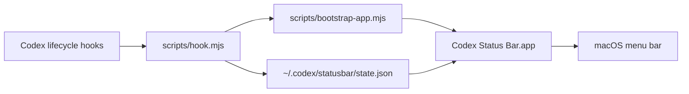

# Codex Bar

Native macOS menu bar telemetry for Codex.

Codex Status Bar shows useful at-a-glance state while Codex is working: running sessions, completed sessions, approvals that need attention, active duration, tool activity, and task progress when Codex exposes plan-like data through lifecycle hooks.

It is intentionally boring in the places that matter:

- No Codex.app patching.
- No scraping private SQLite logs.
- No prompt or command output stored by default.
- No busy polling loop in hook scripts.
- One small JSON state file under `~/.codex/statusbar/state.json`.
- A native AppKit menu bar process that refreshes once per second with timer tolerance.

## Status

Early macOS-first implementation. The hook reducer, native formatter, app packaging, and tests are in progress.

## Install From Codex

After the repo is published, add the marketplace source:

```bash
codex plugin marketplace add Cjbuilds/Codex-bar
```

Then restart Codex, open `/plugins`, choose the new marketplace, install **Codex Status Bar**, and review/trust its hooks when Codex asks.

The plugin starts the menu bar app on the first Codex hook event. You can also build and launch it manually:

```bash
npm run build:app
open -gj "$HOME/.codex/statusbar/Codex Status Bar.app"
```

## Local Development

```bash
npm run test
npm run test:swift
npm run build:app
```

Full local verification:

```bash
npm run verify
```

## Architecture



The hook script receives Codex hook JSON on stdin, extracts non-sensitive event metadata, updates the local state file atomically, and asks the bootstrap script to launch the app. The bootstrap script builds the Swift app if needed and opens it as a background menu bar app.

## What It Shows

- Approvals that need the user's attention.
- Task progress when a hook payload contains plan or todo-style data.
- Running session count.
- Completed session count.
- Active duration.
- Current tool name.
- Recent session/project names.

## Privacy And Security

Codex Status Bar stores only derived operational metadata. It does not store prompt text, model responses, command output, tool results, API keys, access tokens, or Codex logs.

See [SECURITY.md](SECURITY.md) for the threat model and reporting process.

## License

MIT. See [LICENSE](LICENSE).
