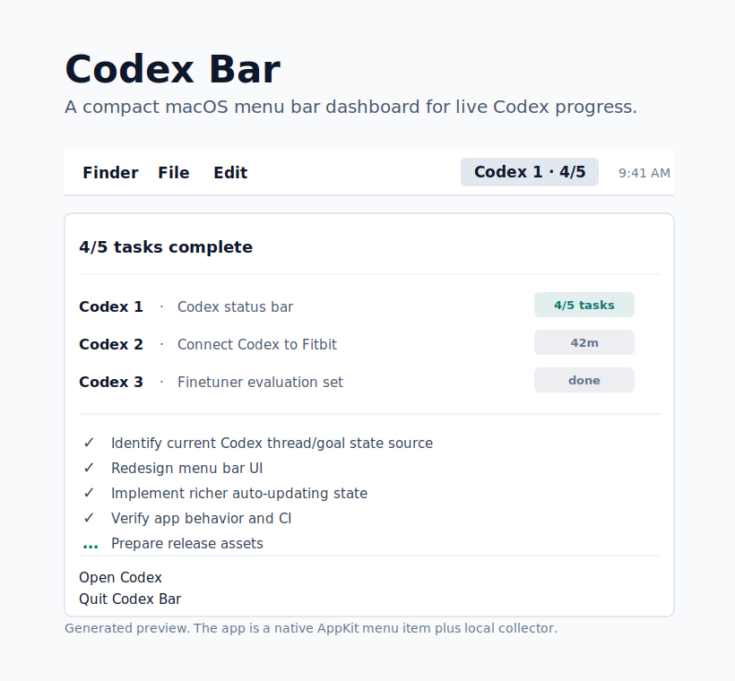
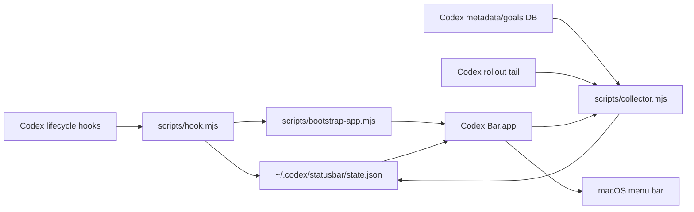

# Codex Bar

Native macOS menu bar dashboard for Codex.

Codex Bar shows useful at-a-glance state while Codex is working: live sessions, task progress, goal state, approval attention, current tool activity, and one-click links back into Codex threads.



It is intentionally boring in the places that matter:

- No Codex.app patching.
- No raw transcript mirroring.
- No raw prompt, model response, command output, or tool result storage.
- No busy polling loop in hook scripts.
- One small JSON state file under `~/.codex/statusbar/state.json`.
- A native AppKit menu bar process with a lightweight local collector and one-second UI refresh.

## Status

MacOS-first MVP under active development. The native app, local collector, hook reducer, packaging, and tests are implemented.

## Install From Codex

Add the marketplace source:

```bash
codex plugin marketplace add Cjbuilds/Codex-bar
```

Then restart Codex, open `/plugins`, choose the new marketplace, install **Codex Bar**, and review/trust its hooks when Codex asks.

The plugin starts the menu bar app on the first Codex hook event. You can also build and launch it manually:

```bash
npm run install:local
```

`npm run install:local` builds the native app, launches it, waits for the collector, and runs the live doctor. It is the quickest local check after installing from Codex or cloning the repo.

Verify only the local app bundle and bundled collector:

```bash
npm run doctor
```

After launching the app, verify that the menu bar process, collector, and local state file are alive:

```bash
npm run doctor -- --live
```

Run a no-side-effect state smoke test for approval, progress, and completion:

```bash
npm run smoke:state
```

Render those same states through the native Swift formatter used by the menu app:

```bash
npm run smoke:render
```

Audit the live state file for raw payload/transcript/output-shaped data:

```bash
npm run audit:privacy
```

Temporarily demo the live menu bar attention states without touching real Codex data:

```bash
npm run demo:live
```

The demo stops the normal Codex Bar process, launches the actual native app against a temporary state file with the collector disabled, cycles through approval, progress, and completed states, then restores the normal app if it was running.

Sample live CPU and memory usage:

```bash
npm run perf:sample -- --duration-ms 30000 --interval-ms 2000
```

## Local Development

```bash
npm run generate:assets
npm run validate:plugin
npm run test
npm run test:swift
npm run install:local
npm run smoke:state
npm run smoke:render
npm run audit:privacy
npm run demo:live
npm run perf:sample -- --duration-ms 30000 --interval-ms 2000
```

Full local verification:

```bash
npm run verify
```

`npm run verify` is the same gate used by GitHub Actions on `main` and pull requests: generated asset freshness, plugin metadata validation, Node tests, hook state smoke, native menu render smoke, Swift tests, the signed macOS app build, the install doctor, and the release artifact packager.

Create a release zip without touching your live installed app:

```bash
npm run package:release
```

That writes `dist/codex-bar-v<version>-macos-<arch>.zip` plus a matching `.sha256` checksum. CI runs the same packager and uploads those files as a workflow artifact.

By default, local and CI release artifacts are ad-hoc signed. To create a Developer ID signed artifact from a machine that already has the certificate in its keychain:

```bash
CODEX_STATUS_BAR_SIGN_IDENTITY="Developer ID Application: Your Name (TEAMID)" npm run package:release
```

To notarize and staple the app before the final zip is written, also set `CODEX_STATUS_BAR_NOTARIZE=1` and one notarization credential set:

```bash
CODEX_STATUS_BAR_SIGN_IDENTITY="Developer ID Application: Your Name (TEAMID)" \
CODEX_STATUS_BAR_NOTARIZE=1 \
CODEX_STATUS_BAR_NOTARY_PROFILE=codex-bar \
npm run package:release
```

`CODEX_STATUS_BAR_NOTARY_PROFILE` uses a profile saved with `xcrun notarytool store-credentials`. The packager also supports App Store Connect API key variables (`CODEX_STATUS_BAR_NOTARY_KEY`, `CODEX_STATUS_BAR_NOTARY_KEY_ID`, `CODEX_STATUS_BAR_NOTARY_ISSUER`) or Apple ID app-password variables (`CODEX_STATUS_BAR_NOTARY_APPLE_ID`, `CODEX_STATUS_BAR_NOTARY_PASSWORD`, `CODEX_STATUS_BAR_NOTARY_TEAM_ID`).

Publish a GitHub Release by pushing a tag that exactly matches `package.json`:

```bash
git tag v0.1.0
git push origin v0.1.0
```

The release workflow runs the full verification gate, checks the tag against the package version, then attaches the release zip and checksum to the GitHub Release.

The current macOS zip is ad-hoc signed and verified by CI, but it is not notarized yet. macOS may require approval on first launch.

Verify the published GitHub Release asset by downloading the zip/checksum, checking SHA-256, and inspecting the app bundle contents:

```bash
npm run verify:published
```

## Architecture



The hook script receives Codex hook JSON on stdin, extracts non-sensitive event metadata, updates the local state file atomically, and asks the bootstrap script to launch the app. The native app starts a bundled collector that reads local Codex metadata/goals, Codex-generated session titles from `session_index.jsonl`, plus structured `update_plan` calls from recent rollout tails. It writes only a minimized dashboard snapshot.

## What It Shows

- Approvals that need the user's attention.
- Compact menu bar status like `Codex 1 · 2/5`, `Codex 2 · 42m`, `Codex 3 · done`, or `Codex 1 · !`.
- Task progress like `2/5 tasks`.
- Goal state like `goal active` or `goal complete`.
- Running and today's recent session rows such as `Codex 1 · Fix things · Connect Codex to Fitbit · 42m` or `Codex 2 · Fix things · Codex status bar · 3/5 tasks`.
- Current tool name.
- Clickable session rows that open `codex://threads/<thread-id>` in Codex.

Idle sessions from previous days are hidden by default so the menu stays focused on real-time work. Active, approval-needed, running, goal, and today's sessions stay visible.

## Codex App Integration

Codex Bar runs as a separate native macOS menu bar item. That is intentional for now: Codex's documented plugin surface covers skills, apps, MCP servers, lifecycle hooks, and deep links, but does not document a supported API for injecting custom items into Codex Desktop's own menu bar menu.

The app does use supported Codex deep links, so clicking a session row opens the matching thread in Codex.

## Privacy And Security

Codex Bar stores only a minimized local dashboard snapshot. By default, it stores a short sanitized session label from Codex's generated session title, falling back to Codex's thread title or preview only when the generated title is unavailable. Set `CODEX_STATUS_BAR_HIDE_TITLES=1` before launching the collector/app to fall back to folder names only.

It does not store raw transcripts, model responses, command output, tool results, API keys, access tokens, or full Codex logs.

See [SECURITY.md](SECURITY.md) for the threat model and reporting process.

## License

MIT. See [LICENSE](LICENSE).
