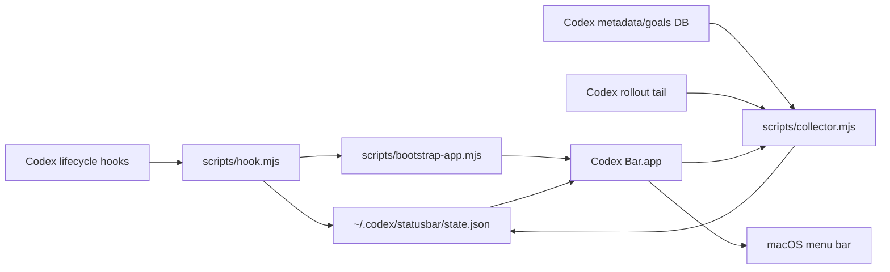

# Codex Bar

Native macOS menu bar dashboard for Codex.

Codex Bar shows useful at-a-glance state while Codex is working: live sessions, task progress, goal state, approval attention, current tool activity, and one-click links back into Codex threads.


It is intentionally boring in the places that matter:

- No Codex.app patching.
- No raw transcript mirroring.
- No raw prompt, model response, command output, or tool result storage.
- No busy polling loop in hook scripts.
- One small JSON state file under `~/.codex/statusbar/state.json`.
- A native AppKit menu bar process with a lightweight local collector and one-second UI refresh.

## Status

MacOS-first MVP under active development. The native app, local collector, hook reducer, packaging, and tests are implemented.

## Install From Codex

After the repo is published, add the marketplace source:

```bash
codex plugin marketplace add Cjbuilds/Codex-bar
```

Then restart Codex, open `/plugins`, choose the new marketplace, install **Codex Bar**, and review/trust its hooks when Codex asks.

The plugin starts the menu bar app on the first Codex hook event. You can also build and launch it manually:

```bash
npm run build:app
open -gj "$HOME/.codex/statusbar/Codex Bar.app"
```

Verify the local app bundle and bundled collector:

```bash
npm run doctor
```

After launching the app, verify that the menu bar process, collector, and local state file are alive:

```bash
npm run doctor -- --live
```

## Local Development

```bash
npm run generate:assets
npm run validate:plugin
npm run test
npm run test:swift
npm run build:app
npm run doctor
```

Full local verification:

```bash
npm run verify
```

`npm run verify` is the same gate used by GitHub Actions on `main` and pull requests: generated asset freshness, plugin metadata validation, Node tests, Swift tests, the signed macOS app build, and the install doctor.

## Architecture



The hook script receives Codex hook JSON on stdin, extracts non-sensitive event metadata, updates the local state file atomically, and asks the bootstrap script to launch the app. The native app starts a bundled collector that reads local Codex metadata/goals plus structured `update_plan` calls from recent rollout tails. It writes only a minimized dashboard snapshot.

## What It Shows

- Approvals that need the user's attention.
- Compact menu bar status like `Codex 1 · 2/5`, `Codex 2 · 42m`, `Codex 3 · done`, or `Codex 1 · !`.
- Task progress like `2/5 tasks`.
- Goal state like `goal active` or `goal complete`.
- Running and today's recent session rows such as `Codex 1 · Fix things · Connect Codex to Fitbit · 42m` or `Codex 2 · Fix things · Codex status bar · 3/5 tasks`.
- Current tool name.
- Clickable session rows that open `codex://threads/<thread-id>` in Codex.

Idle sessions from previous days are hidden by default so the menu stays focused on real-time work. Active, approval-needed, running, goal, and today's sessions stay visible.

## Codex App Integration

Codex Bar runs as a separate native macOS menu bar item. That is intentional for now: Codex's documented plugin surface covers skills, apps, MCP servers, lifecycle hooks, and deep links, but does not document a supported API for injecting custom items into Codex Desktop's own menu bar menu.

The app does use supported Codex deep links, so clicking a session row opens the matching thread in Codex.

## Privacy And Security

Codex Bar stores only a minimized local dashboard snapshot. By default, it stores a short sanitized session label from Codex's thread title or preview so the menu can show what each session is about. Set `CODEX_STATUS_BAR_HIDE_TITLES=1` before launching the collector/app to fall back to folder names only.

It does not store raw transcripts, model responses, command output, tool results, API keys, access tokens, or full Codex logs.

See [SECURITY.md](SECURITY.md) for the threat model and reporting process.

## License

MIT. See [LICENSE](LICENSE).
