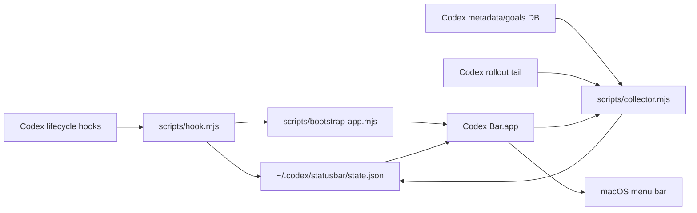

# Codex Bar

Native macOS menu bar dashboard for Codex.

Codex Bar shows useful at-a-glance state while Codex is working: live sessions, task progress, goal state, approval attention, current tool activity, and one-click links back into Codex threads.

It is intentionally boring in the places that matter:

- No Codex.app patching.
- No raw transcript mirroring.
- No prompt or command output stored by default.
- No busy polling loop in hook scripts.
- One small JSON state file under `~/.codex/statusbar/state.json`.
- A native AppKit menu bar process with a lightweight local collector and one-second UI refresh.

## Status

MacOS-first MVP under active development. The native app, local collector, hook reducer, packaging, and tests are implemented.

## Install From Codex

After the repo is published, add the marketplace source:

```bash
codex plugin marketplace add Cjbuilds/Codex-bar
```

Then restart Codex, open `/plugins`, choose the new marketplace, install **Codex Bar**, and review/trust its hooks when Codex asks.

The plugin starts the menu bar app on the first Codex hook event. You can also build and launch it manually:

```bash
npm run build:app
open -gj "$HOME/.codex/statusbar/Codex Bar.app"
```

## Local Development

```bash
npm run test
npm run test:swift
npm run build:app
```

Full local verification:

```bash
npm run verify
```

## Architecture



The hook script receives Codex hook JSON on stdin, extracts non-sensitive event metadata, updates the local state file atomically, and asks the bootstrap script to launch the app. The native app starts a bundled collector that reads local Codex metadata/goals plus structured `update_plan` calls from recent rollout tails. It writes only a minimized dashboard snapshot.

## What It Shows

- Approvals that need the user's attention.
- Task progress like `2/5 tasks`.
- Goal state like `goal active` or `goal complete`.
- Running/recent session rows such as `Codex 1 - Fix things - 2/5 tasks`.
- Current tool name.
- Clickable session rows that open `codex://threads/<thread-id>` in Codex.

## Privacy And Security

Codex Bar stores only derived operational metadata. It does not store prompt text, model responses, command output, tool results, API keys, access tokens, or full Codex logs.

See [SECURITY.md](SECURITY.md) for the threat model and reporting process.

## License

MIT. See [LICENSE](LICENSE).
